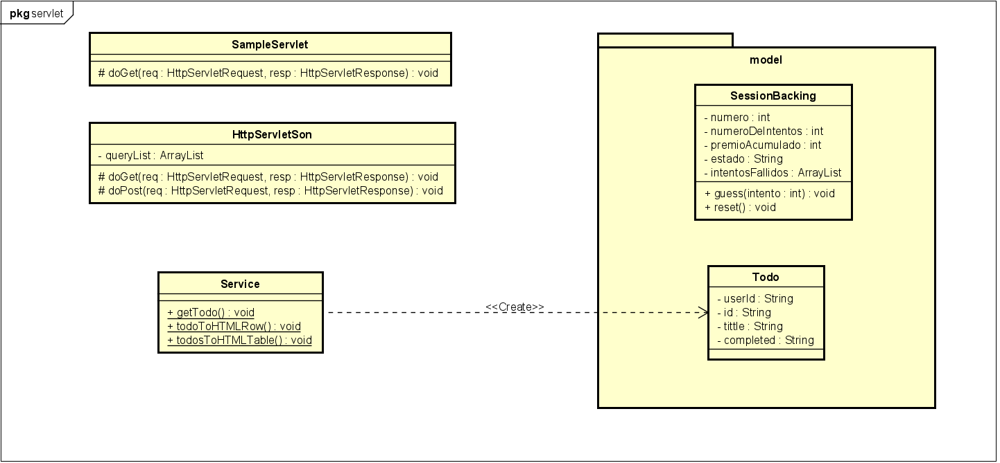

# Laboratorio 5 - MVC Primefaces Introduction - 2020-1
> Universidad: _Escuela Colombiana de Ingeniería_

> Asignatura:  _Ciclos de Vida del Desarrollo de Software_

> Autor: _Davor Cortés_

---
## Algunos errores HTTP:
-	Error 400 __(Bad Request)__ : se presentan si el servidor no puede completar la consulta (GET)
-	Error 404 __(Not Found)__ : se presentan si el servidor no encuentra la solicitud
-	Error 408 __(Request Timeout)__ : se presentan si el servidor agota el tiempo de espera
-	Error 500 __(Internal Server)__ : se presentan si se presenta un fallo o error al ejecutar una solicitud

## Diferencia entre usar GET y POST:
El método de envío de la información al servidor cambia.
**Get** envía los parámetros de manera visible al usuario.
**Post** envía los parámetros de manera invisible al usuario.

Otros metodos similares:
- Get se usa para solicitar datos de un recurso especifico.
- Post se usa para enviar datos a un servidor para crear / actualizar un recurso.
- Put se usa para enviar datos a un servidor para crear / actualizar un recurso.
- Head es casi idéntico a GET, pero sin el cuerpo de respuesta.
- Delete elimina el recurso especificado.

## Funcionamiento de la clase Service:
 `Service` se encarga de hacer intermediario con Json para obtener la información de la ID especificada.
 esta ID es presentada por medio de una tabla, al dirigirnos a la página de nuestro servidor se puede ver
 una casilla para ingresar la información de una ID específica, es aquí donde usamos `Service` para poder 
 consumir los datos del sitio `https://jsonplaceholder.typicode.com/todos/1` y visualizarlos en nuestro sitio.
 
## Diagrama de Clases
Paquete servlet

